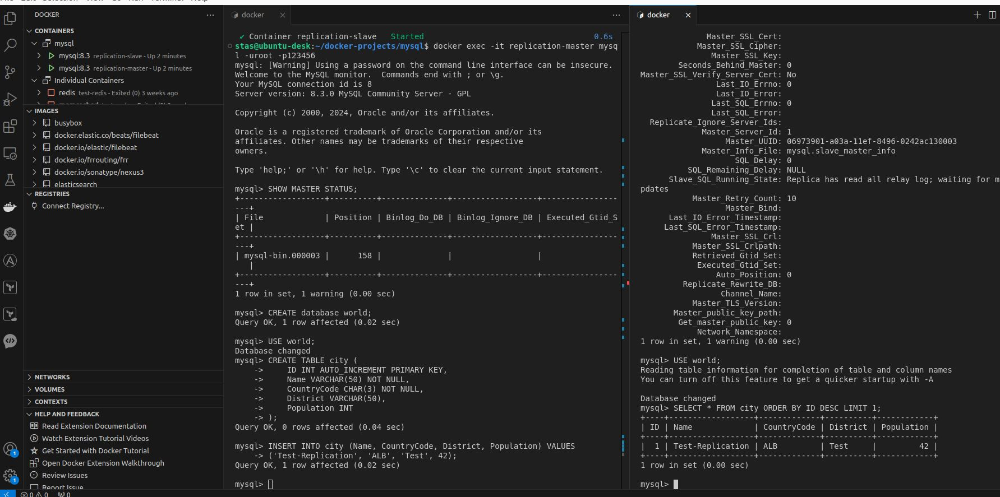
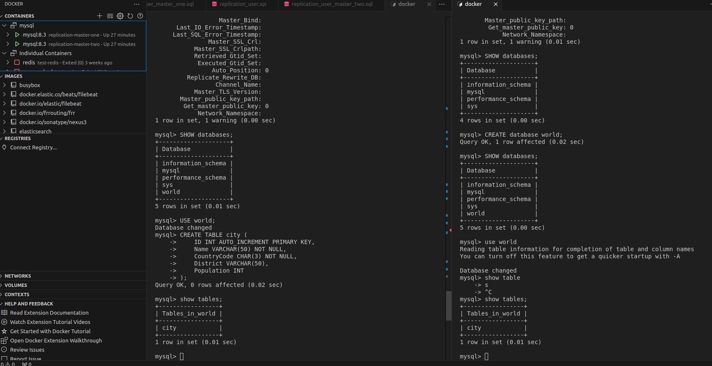

# Домашнее задание к занятию «Репликация и масштабирование. Часть 1» Помельников С.В.

---

### Задание 1

На лекции рассматривались режимы репликации master-slave, master-master, опишите их различия.

*Ответить в свободной форме.*

### Решение 1   

Мастер-мастер базы данных могут принимать записи и синхронизируются между собой  
Мастер-слейв: только мастер принимает записи, а слейв — копия, используемая для чтения и резервного копирования  

---

### Задание 2

Выполните конфигурацию master-slave репликации, примером можно пользоваться из лекции.

*Приложите скриншоты конфигурации, выполнения работы: состояния и режимы работы серверов.*

### Решение 2 

```
services:
  mysql-master:
    image: mysql:8.3
    container_name: replication-master
    environment:
      MYSQL_ROOT_PASSWORD: 123456
    command: >
      --server-id=1
      --log-bin=/var/lib/mysql/mysql-bin.log
    volumes:
      - ./replication_user.sql:/docker-entrypoint-initdb.d/replication_user.sql

  mysql-slave:
    image: mysql:8.3
    container_name: replication-slave
    environment:
      MYSQL_ROOT_PASSWORD: 123456
    command: >
      --server-id=2
      --log-bin=mysql-bin
      --relay-log=/var/lib/mysql/mysql-relay-bin
      --relay-log-index=/var/lib/mysql/mysql-relay-bin.index
      --read-only=1
```




---

## Дополнительные задания (со звёздочкой*)


### Задание 3* 

Выполните конфигурацию master-master репликации. Произведите проверку.

*Приложите скриншоты конфигурации, выполнения работы: состояния и режимы работы серверов.*

### Решение 3   

```
services:
  mysql-master-one:
    image: mysql:8.3
    container_name: replication-master-one
    environment:
      MYSQL_ALLOW_EMPTY_PASSWORD: "true"
    command: >
      --server-id=1
      --log-bin=/var/lib/mysql/mysql-bin-1.log
      --binlog-format=ROW
      --auto-increment-increment=2
      --auto-increment-offset=1
    volumes:
      - ./replication_user_master_one.sql:/docker-entrypoint-initdb.d/replication_user_master_one.sql

  mysql-master-two:
    image: mysql:8.3
    container_name: replication-master-two
    environment:
      MYSQL_ALLOW_EMPTY_PASSWORD: "true"
    command: >
      --server-id=2
      --log-bin=/var/lib/mysql/mysql-bin-2.log
      --binlog-format=ROW
      --auto-increment-increment=2
      --auto-increment-offset=2
    volumes:
      - ./replication_user_master_two.sql:/docker-entrypoint-initdb.d/replication_user_master_two.sql
```



