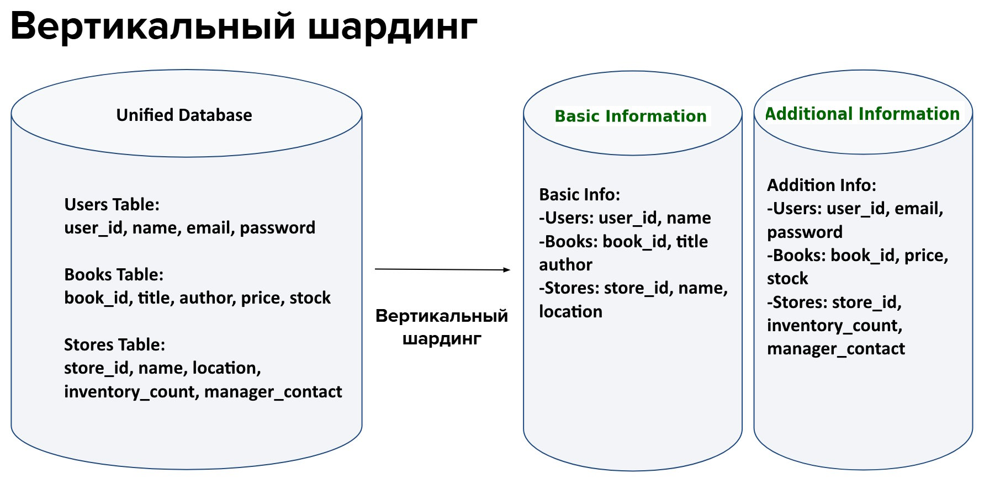
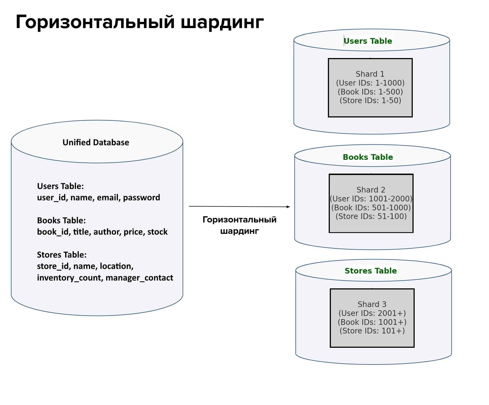

# Домашнее задание к занятию «Репликация и масштабирование. Часть 2» Помельников С.В.

---

### Задание 1

Опишите основные преимущества использования масштабирования методами:

- активный master-сервер и пассивный репликационный slave-сервер; 
- master-сервер и несколько slave-серверов;

*Дайте ответ в свободной форме.*

### Решение 1   

- активный master-сервер и пассивный репликационный slave-сервер: Резервное копирование, Быстрое восстановление, Простота настройки  
- master-сервер и несколько slave-серверов: Повышение производительности, Масштабируемость, Высокая доступность  

---

### Задание 2

Разработайте план для выполнения горизонтального и вертикального шаринга базы данных. База данных состоит из трёх таблиц: 

- пользователи, 
- книги, 
- магазины (столбцы произвольно). 

Опишите принципы построения системы и их разграничение или разбивку между базами данных.

*Пришлите блоксхему, где и что будет располагаться. Опишите, в каких режимах будут работать сервера.* 

### Решение 2   

### Вертикальное шардирование
### Принципы распределения данных:
Сервера:
- Первый сервер будет хранить основную информацию для каждой таблицы.
- Второй сервер будет хранить дополнительную информацию для каждой таблицы.
- Основной вид базы данных (Unified Database) объединяет данные из обоих шардов, создавая единую точку доступа
  
Преимущества:
- Повышение безопасности: чувствительная информация (например, пароли и контакты) хранится отдельно.
- Повышение производительности: запросы, которым требуется только основная информация, могут выполняться быстрее, так как серверы могут обрабатывать их параллельно.

### Горизонтальное шардирование
### Принципы распределения данных:
- Каждая таблица разбивается на отдельные физические базы данных (шарды) по значениям идентификаторов.
- Шардирование по диапазонам идентификаторов (например, user_id, book_id, store_id) упрощает распределение и упрощает запросы по этим таблицам.
- Основной вид базы данных (Unified Database) объединяет данные из всех шардов, чтобы приложения могли работать с ними как с единой базой данных.

---

## Дополнительные задания (со звёздочкой*)

---
### Задание 3*

Выполните настройку выбранных методов шардинга из задания 2.

*Пришлите конфиг Docker и SQL скрипт с командами для базы данных*.

### Решение 3   

Мастер-мастер базы данных могут принимать записи и синхронизи
