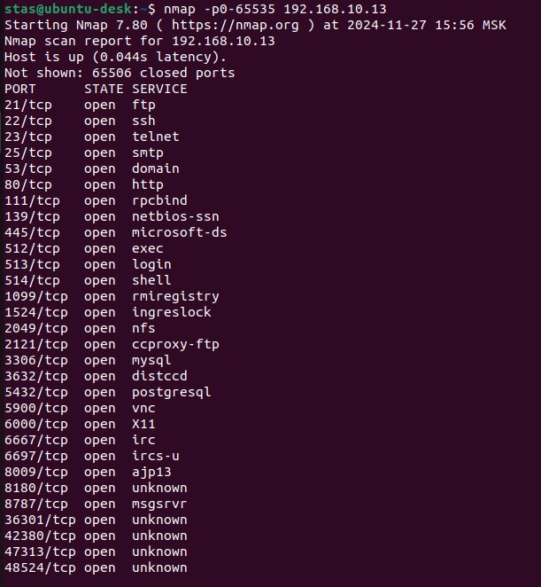

# Домашнее задание к занятию «Уязвимости и атаки на информационные системы»  Помельников С.В.

------

### Задание 1

Скачайте и установите виртуальную машину Metasploitable: https://sourceforge.net/projects/metasploitable/.

Это типовая ОС для экспериментов в области информационной безопасности, с которой следует начать при анализе уязвимостей.

Просканируйте эту виртуальную машину, используя **nmap**.

Попробуйте найти уязвимости, которым подвержена эта виртуальная машина.

Сами уязвимости можно поискать на сайте https://www.exploit-db.com/.

Для этого нужно в поиске ввести название сетевой службы, обнаруженной на атакуемой машине, и выбрать подходящие по версии уязвимости.

Ответьте на следующие вопросы:

- Какие сетевые службы в ней разрешены?
- Какие уязвимости были вами обнаружены? (список со ссылками: достаточно трёх уязвимостей)
  
*Приведите ответ в свободной форме.*  

### Решение 1

- Very Secure FTP Daemon - Уязвимость CVE-2011-2523 (USER test: открывает обратное подключение на порт 6200)
- OpenSSH (4.7p1) - CVE-2015-5600: Уязвимости в механизме авторизации (позволяет выполнить массовый перебор учетных данных через одну сессию SSH)
- SMTP (25/tcp) - Уязвим к атакам типа VRFY (позволяет проверить существование пользователя через telnet запрос - например VRFY root)

------

### Задание 2

Проведите сканирование Metasploitable в режимах SYN, FIN, Xmas, UDP.

Запишите сеансы сканирования в Wireshark.

Ответьте на следующие вопросы:

- Чем отличаются эти режимы сканирования с точки зрения сетевого трафика?
- Как отвечает сервер?
  
*Приведите ответ в свободной форме.*

### Решение 2

- в режиме SYN сервер отвечает SYN если порт открыт или RST если порт закрыт
- в режиме FIN сервер не отвечает если порт открыт(или фильтруется) или RST если порт закрыт
- в режиме Xmas похоже на FIN, но выставляются дополнительные флаги PSH и URG
- в режиме UDP нет установки каких то флагов как в TCP, просто отправлятся минимальный пакет UDP, если сервер отклоняет пакет ответом с ICMP - Destination Unreachable, то считается что порт закрыт, если не отвечает или отвечает отлично от Destination Unreachable (например DNS 53 может ответить Not implemented), то порт считается открытый (или фильтруется)
